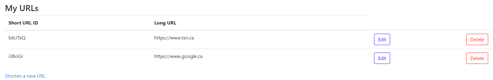

# TinyApp Project

TinyApp is a full stack web application built with Node and Express that allows users to shorten long URLs (à la bit.ly).

## Final Product

The 'home' page of the TinyApp application, displaying all the URLs the user creates. There are edit and delete buttons to manipulate the existing URLs, and a button to create new ones.

The page which allows the user to shorten a new URL. The navigation bar at the top is always present on every page so that users can always redirect themselves easily.

## Dependencies

- Node.js
- Express
- EJS
- bcryptjs
- cookie-session

## Getting Started

- Install all dependencies (using the `npm install` command).
- Run the development web server using the `node express_server.js` command.